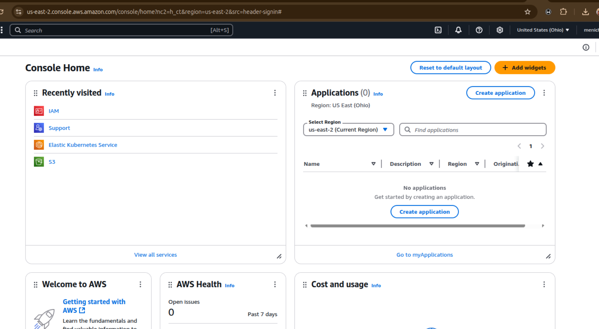

# TechEnviromentSetup

## Install Visual Studio Code Editor
  - Go to <https://www.code.visualstudio.com/download>
  - Download for Debian Ubuntu

 

  - Install the downloaded file. Click "next" to prompt and click "FINISH' to complete installation

  
  
---
# Install git on ubuntu
### Run the following commands
> sudo apt update -y

> sudo apt install git

### Verify git installation
> git --version

# My system is running on ubuntu 24.04

# Create a github account

### Visit [github website](https://www.github.com)

## Signup and create your own github account

# Create AWS account

### Visit [aws website](https://aws.amazon.com/free/?gclid=EAIaIQobChMIooK08a7LjAMVqZdQBh1izwyDEAAYASAAEgInZvD_BwE&trk=75f8a2e0-36ab-432b-bc54-675c3c4e7c6f&sc_channel=ps&ef_id=EAIaIQobChMIooK08a7LjAMVqZdQBh1izwyDEAAYASAAEgInZvD_BwE:G:s&s_kwcid=AL!4422!3!733981739756!e!!g!!aws%20console!22258829493!178306028067&all-free-tier.sort-by=item.additionalFields.SortRank&all-free-tier.sort-order=asc&awsf.Free%20Tier%20Types=*all&awsf.Free%20Tier%20Categories=*all)

### Follow the instruction and create free tier AWS account

### Login to your AWS free tier as root user

### Access your AWS Dashboard

